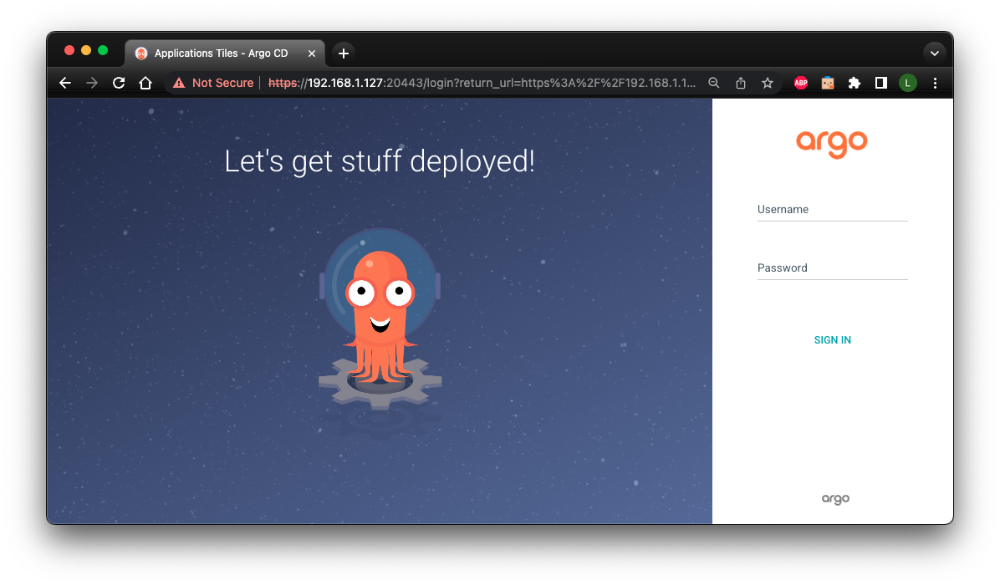
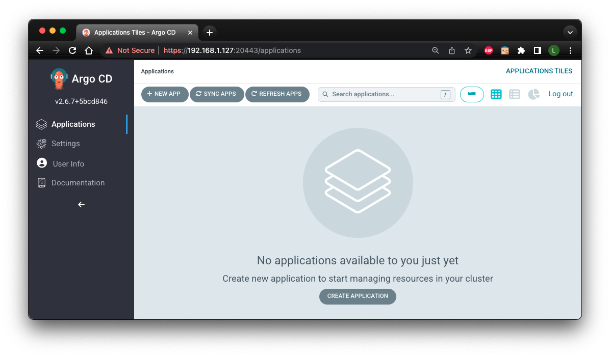
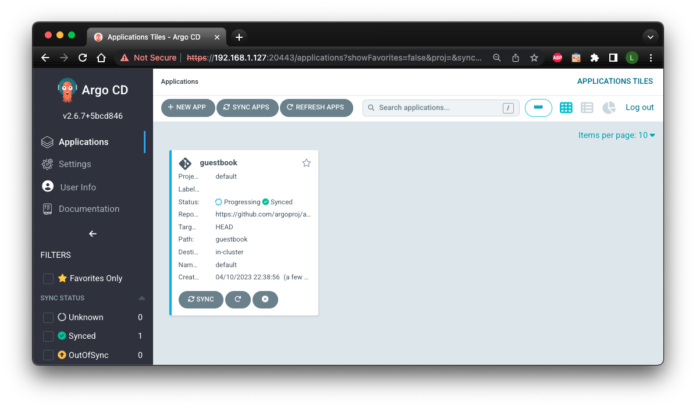
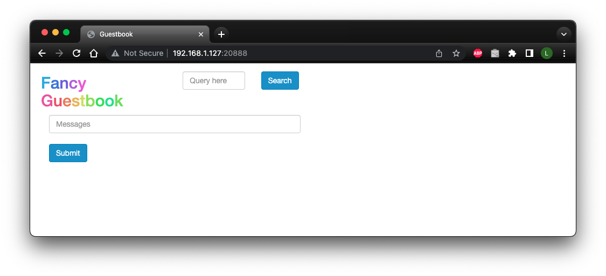

# Argo CD

!!! tag "[Makester v0.2.4](https://github.com/loum/makester/releases/tag/0.2.4)"

[Argo CD](https://argo-cd.readthedocs.io/en/stable/){target="_blank"} Argo CD is a
declarative, GitOps continuous delivery tool for Kubernetes.

## Getting started

If you are operating Makester in [minimal mode](../../../getting-started#minimal-mode), then
append `microk8s` and `argocd` to `MAKESTER__INCLUDES` to enable the Makester Argo CD subsystem.

Argo CD needs to be deployed into a Kubernetes cluster. As such, Start by checking the MicroK8s status:

``` sh title="MicroK8s status should be in the 'running' state."
make microk8s-status
```

Follow the prompts to start MicroK8s, or refer to the Makester [`microk8s`](../makefiles/k8s/microk8s.md)
subsystem documentation for further information on how to install MicroK8s.

To get an Argo CD instance deployed onto MicroK8s with minimal fuss:

``` sh
make argocd-up
```

On successful completion of the target, you will be provided with the URL to the Argo CD API
server and the login credentials. For example:

``` sh title=""
...
### Waiting for argocd-server pod in argocd namespace to be ready ...
2023-04-10 21:48:46 logga [INFO]: Checking host:port 192.168.1.127:20443 Argo CD API server ...
2023-04-10 21:48:47 logga [INFO]: Port 20443 ready
### Argo CD API Server address forwarded to: https://192.168.1.127:20443
### Argo CD API Server log output can be found at /home/lupco/dev/makester/.makester/argocd-dashboard.out
### Login to the Argo CD API Server as user "admin" with following password:
bT9jKItiqd3tmSfY
```


Enter the credentials to land on the main Argo CD applications page:


A sample web app can be deployed to demonstrates how to enable a service with Argo CD:

``` sh
make argocd-example
```

You can interact with the app deployment via the Argo CD applications page:


To remove the sample app:

``` sh
make argocd-example-del
```

To clean up all resources:

``` sh
make argocd-down
```

## Command reference

### Login to the Argo CD CLI
Use the password generated with the `argocd-creds` target.

``` sh
make argocd-cli-login 
```

### Dump the Argo CD credentials in plain-text

``` sh
make argocd-creds
```

Sample output:

``` sh title="Sample Argo CD credentials."
### Login to the Argo CD API Server as user "admin" with following password:
bT9jKItiqd3tmSfY
```

### Start the Argo CD API server
The target will also provide the credentials required to basic authenticate against the Argo CD
API server UTR:

``` sh
make argocd-dashboard
```

Sample output:

``` sh title=""
2023-04-10 21:51:12 logga [INFO]: Checking host:port 192.168.1.127:20443 Argo CD API server ...
2023-04-10 21:51:13 logga [INFO]: Port 20443 ready
### Argo CD API Server address forwarded to: https://192.168.1.127:20443
### Argo CD API Server log output can be found at .makester/argocd-dashboard.out
### Login to the Argo CD API Server as user "admin" with following password:
bT9jKItiqd3tmSfY
```

### Stop the Argo CD API server
Tears down the Kubernetes port-forward to the Argo CD API server.

``` sh
make argocd-dashboard-stop
```

### Depoly Argo CD into MicroK8s
Convenience all-in-one target to stand up an ArgoCD instance:

``` sh
make argocd-deploy
```

### Argo CD deployment clean up

``` sh
make argocd-down
```

### Create the Argo CD example guestbook application
You will be prompted for the Argo CD CLI login credentials that are the same as those provided
by the `argocd-dashboard` target:

``` sh
make argocd-example
```

### Delete the Argo CD example guestbook application

``` sh
make argocd-example-del
```

### Start the Argo CD example guestbook application UI
Creates a Kubernetes port-forward to the sample web app:

``` sh
make argocd-example-ui
```

Sample output:

``` sh title="Argo CD sample web app output."
### Argo CD Example App UI: http://192.168.1.127:20888 (Ctrl-C to stop)
Forwarding from 0.0.0.0:20888 -> 80
```

The web app is a simple interface with limited capability:


### Install an ArgoCD instance into the "argocd" namespace

``` sh
make argocd-install
```

### Create the "argocd" namespace

``` sh
make argocd-ns
```

### Delete the "argocd" namespace

``` sh
make argocd-ns-del
```

### Argo CD deployment and API server setup
All-in-one convenience target to install the required addons and deploy Argo CD into MicroK8s:

``` sh
make argocd-up
```

## Variables

### `MAKESTER__ARGOCD_DASHBOARD_PORT`
The Argo CD API Server port (default `<20443>`).

---
[top](#argo-cd)
